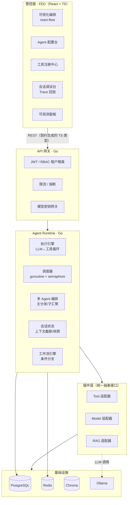

# Keystone 架构与设计决策

> 本文档记录 Keystone 的分层架构、核心设计决策与扩展协议。
> 契约以 `contracts/openapi.yaml` 为准，本文档只做设计说明。

## 1. 分层架构



## 2. 核心设计决策

### 2.1 契约先行（Contract-First）

- `contracts/openapi.yaml` 是**唯一事实源**，禁止手改双端类型；
- 后端：`oapi-codegen` 生成 Go struct + handler 骨架；
- 前端：`openapi-typescript` 生成 TS 类型；
- CI 质量门 `make check` 强制 lint 契约，防止漂移。

**收益**：配置模型与运行时永远一致，业务方看到的配置结构 = 后端存储结构 = 前端表单结构。

### 2.2 Agent 是 Spec，不是 Class

Agent 以 `AgentSpec`（JSON 配置）存在：

```jsonc
{
  "name": "工单助手",
  "systemPrompt": "你是工单处理助手，必要时调用 ${biz_context} 中的上下文",
  "modelRef": "tongyi.qwen-max",
  "toolRefs": ["tool.http.ticket", "tool.code.formatter"],
  "strategy": { "maxIterations": 10, "maxConcurrency": 4, "contextWindow": 8192, "timeoutMs": 60000 }
}
```

平台读取 Spec 实例化运行，**新增 Agent 不需要写代码**，天然支持版本快照与回滚。

### 2.3 并发与防失控

Go 侧通过 `goroutine + semaphore` 并行执行工具调用，并用三重约束防止失控：

1. `maxIterations`：LLM↔工具循环轮次上限；
2. `context.WithTimeout`：单次运行整体超时；
3. `maxConcurrency`：并发工具调用上限（对模型并行工具调用做信号量控制）。

### 2.4 插件协议

```go
// Tool 协议：所有工具统一实现
type Tool interface {
    ID() string
    Name() string
    Description() string
    InputSchema() map[string]any
    Execute(ctx context.Context, params map[string]any, tc ToolContext) (*ToolResult, error)
}
```

新增能力 = 实现协议 + 注册，内核零改动。敏感配置（API Key 等）只存引用（`${secret.XXX}`），密钥不出服务端。

### 2.5 可观测

每次运行生成 `runId` + `traceId`，`TraceEvent` 记录每一步 LLM/工具调用的耗时、token、状态，前端会话调试台可逐步回放，符合企业运维要求。

## 3. 扩展指南（给二次开发者）

| 想做什么 | 怎么做 |
|---|---|
| 接一个新模型 | 实现 `ModelAdapter` 接口，注册到 `model` 注册中心 |
| 加一个业务工具 | 写 `ToolSpec`（Schema 声明）注册，或实现 Go `Tool` 接口 |
| 加一种工具执行方式 | 扩展 `ToolExecution.type` 枚举 + 对应执行器 |
| 让 Agent 用上企业知识库 | 实现 `RAGAdapter`，绑定到 Agent 的 `toolRefs` |
| 编排多步流程 | 前端拖拽 nodes/edges，保存为 `WorkflowSpec`，Runtime 解析执行 |

## 4. 已知局限与优化方向

- 单机 Runtime，无水平扩展：后续引入任务队列 + 多实例消费（Redis Stream）；
- 上下文截断策略仅基础实现：可扩展按角色/按时间衰减的压缩策略；
- 向量库单机 Chroma：生产可换 pgvector / Milvus，协议不变。
